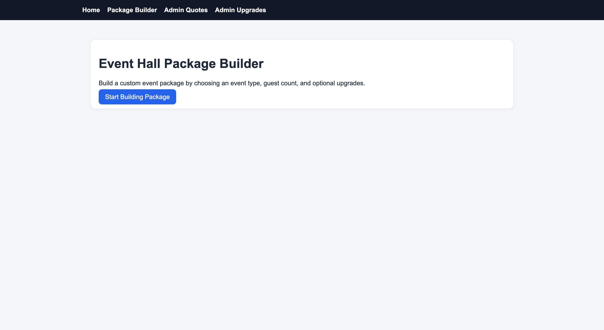
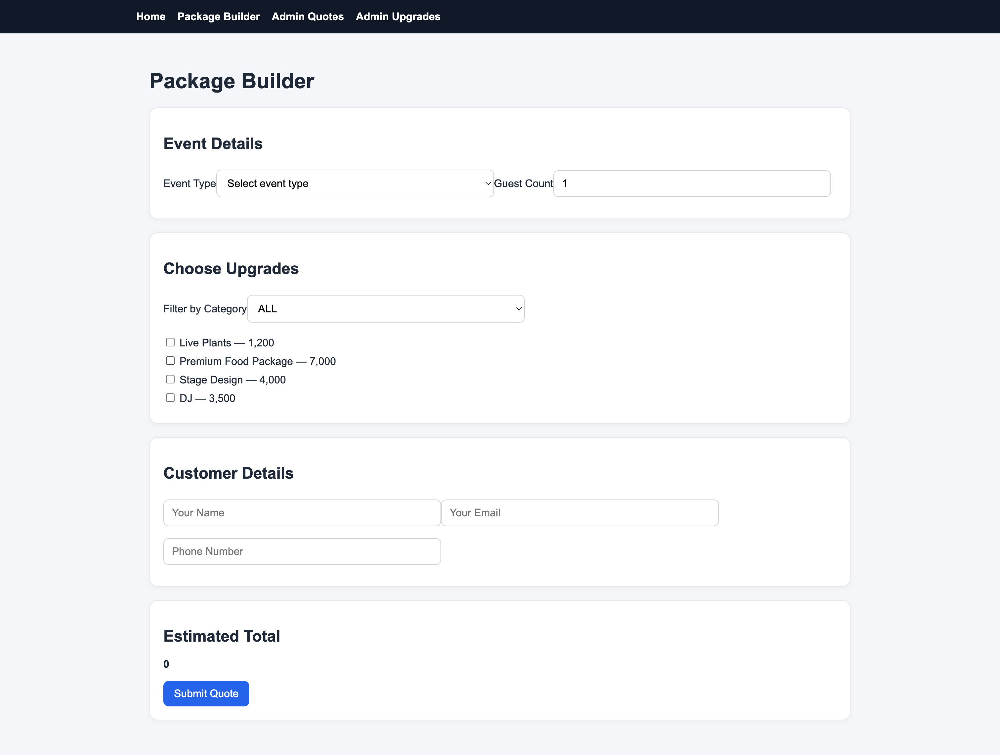
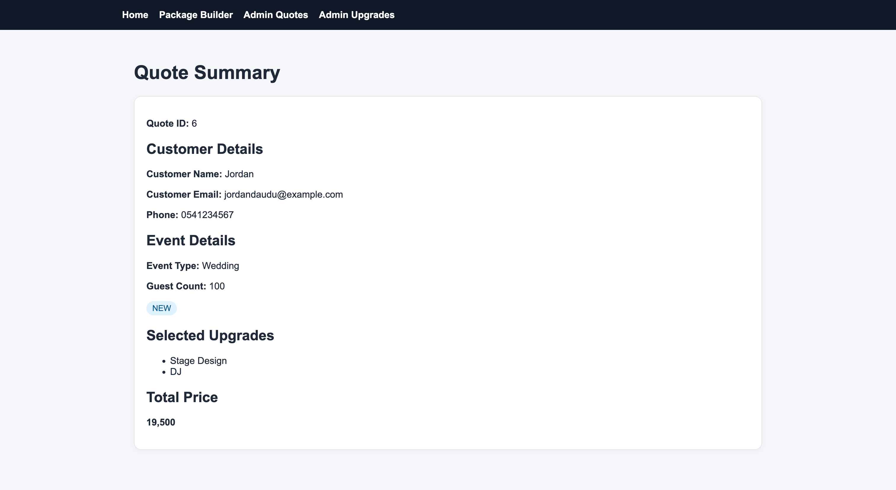
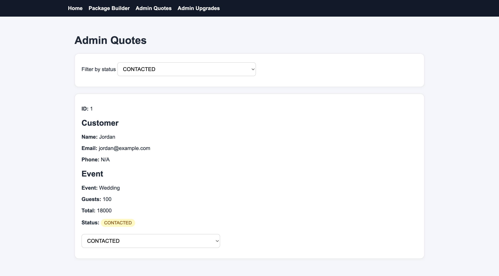
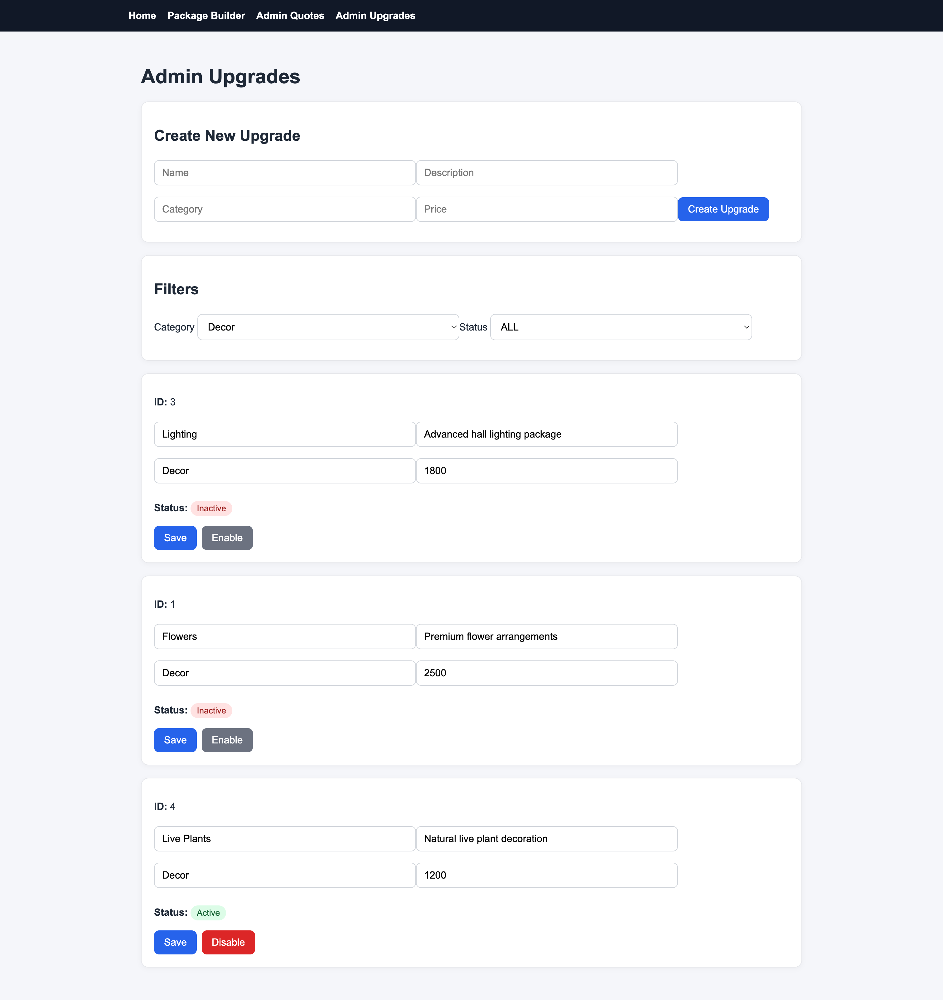

# Event Hall Package Builder

A full-stack portfolio project for building and managing event hall packages, including customer quote requests, admin management, and business analytics.

---

## Overview

Event Hall Package Builder is a full-stack application designed to simulate a real-world business system for event halls.

Customers can build event packages and request quotes, while admins can manage quotes, upgrades, and track business performance through a dashboard.

---

## Key Features

### Customer

- Select event type
- Enter guest count
- Choose upgrades filtered by category
- View live price preview
- Submit quote request
- View quote summary

### Admin

- View and filter quotes
- Update quote status:
  - NEW
  - CONTACTED
  - APPROVED
  - REJECTED
- Manage upgrades:
  - Create
  - Edit
  - Enable / disable
- Soft delete upgrades using the `active` flag
- Filter upgrades by category and status

### Analytics Dashboard

- Total quotes
- Approved quotes
- Conversion rate
- Monthly revenue
- Revenue by event type
- Most selected upgrades

---

## Tech Stack

### Backend

- Java 21
- Spring Boot
- Spring Web
- Spring Data JPA
- PostgreSQL
- Jakarta Validation
- Swagger UI / OpenAPI
- Maven

### Frontend

- React
- Vite
- TypeScript
- Axios
- React Router

### Testing and CI/CD

- JUnit
- MockMvc
- H2 test database
- GitHub Actions
- Docker
- GitHub Container Registry

---

## Architecture

```text
React Frontend
    ↓ REST API
Spring Boot Backend
    ↓ Spring Data JPA
PostgreSQL Database
```

Backend structure:

```text
controller
service
repository
entity
dto
enums
exception
mapper
```

---

## Screenshots

Screenshots should be placed in:

```text
assets/screenshots/
```

### Home



### Package Builder



### Quote Summary



### Admin Dashboard


### Admin Quotes



### Admin Upgrades



---

## API Documentation

When the backend is running, Swagger UI is available at:

```text
http://localhost:8080/swagger-ui.html
```

---

## Main API Endpoints

### Public Endpoints

```text
GET  /api/event-types
GET  /api/upgrades
POST /api/quotes
GET  /api/quotes/{id}
```

### Admin Quote Endpoints

```text
GET /api/admin/quotes
GET /api/admin/quotes?status=NEW
PUT /api/admin/quotes/{id}/status
```

### Admin Upgrade Endpoints

```text
GET    /api/admin/upgrades
POST   /api/admin/upgrades
PUT    /api/admin/upgrades/{id}
DELETE /api/admin/upgrades/{id}
```

### Admin Dashboard Endpoint

```text
GET /api/admin/dashboard?year=2026
```

---

## Pricing Rule

The frontend shows a live price preview for user experience.

The backend calculates the final price for security.

```text
Total Price = (Event Type Base Price × Guest Count) + Selected Upgrades Total
```

---

## Docker Setup

Docker is the recommended way to run the project locally.

Run the full stack:

```bash
docker-compose up --build
```

Frontend:

```text
http://localhost:5173
```

Backend:

```text
http://localhost:8080
```

Stop the application:

```bash
docker-compose down
```

Reset the database volume:

```bash
docker-compose down -v
```

---

## Run Using Prebuilt Images

The project can also run using prebuilt private Docker images from GitHub Container Registry.

Login to GHCR:

```bash
docker login ghcr.io
```

Then run:

```bash
docker compose -f docker-compose.images.yml up
```

Pull latest images:

```bash
docker compose -f docker-compose.images.yml pull
```

---

## Manual Local Development

### Backend

Create a PostgreSQL database:

```text
eventhall_db
```

Set environment variables:

```text
SPRING_DATASOURCE_URL=jdbc:postgresql://localhost:5432/eventhall_db
SPRING_DATASOURCE_USERNAME=postgres
SPRING_DATASOURCE_PASSWORD=your_password
```

Run backend:

```bash
cd backend
./mvnw spring-boot:run
```

Backend runs on:

```text
http://localhost:8080
```

### Frontend

Install dependencies:

```bash
cd frontend
npm install
```

Run frontend:

```bash
npm run dev
```

Frontend runs on:

```text
http://localhost:5173
```

---

## Running Tests

Run backend tests:

```bash
cd backend
./mvnw test
```

The test profile uses an H2 in-memory database, so tests do not require PostgreSQL.

---

## CI/CD

GitHub Actions runs automatically on push.

The pipeline:

- Runs backend tests
- Builds the frontend
- Builds Docker images for ARM64 and AMD64
- Pushes private images to GitHub Container Registry

---

## Important Notes

- Backend is the source of truth for price calculation.
- Admin endpoints do not require authentication in V1.
- Authentication will be added in a later version.
- Upgrade deletion is implemented as soft delete using the `active` field.
- Inactive upgrades are hidden from customers but visible to admins.
- Revenue statistics are based on `approvedAt`, not quote creation time.

---

## Project Status

### V1 Complete

- Spring Boot backend
- PostgreSQL database integration
- React frontend
- Customer quote flow
- Admin quote management
- Admin upgrade management
- API validation
- Testing and CI
- Basic UI polish

### V1.5 Current

- Dockerized full stack
- Private GHCR image publishing
- Admin dashboard
- Business analytics
- Improved admin UI
- Multi-architecture Docker builds

---

## Roadmap

### V1.6

- Cloud deployment
- Managed PostgreSQL
- Environment-based production configuration
- Backup strategy

### V1.7

- Product readiness
- Pricing tiers
- Client onboarding flow
- Branding per client

### V2

- Authentication
- Admin login
- Customer accounts
- Client isolation

### V2.5

- React Native / Expo mobile app
- Same backend API
- Client-owned Apple Developer account support

### V3

- SaaS / licensing system
- Multi-client management
- Automated provisioning
- Billing and subscriptions
- Monitoring and backup/restore process

---

## Key Concepts Practiced

- REST API design
- Layered backend architecture
- JPA relationships
- DTO mapping
- Validation
- Exception handling
- Docker Compose
- CI/CD pipelines
- Private Docker image distribution
- Business analytics
